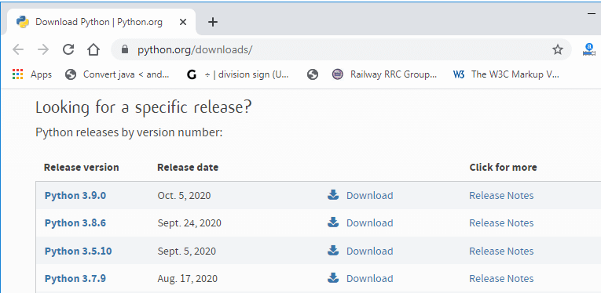
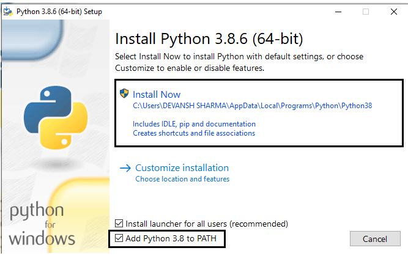
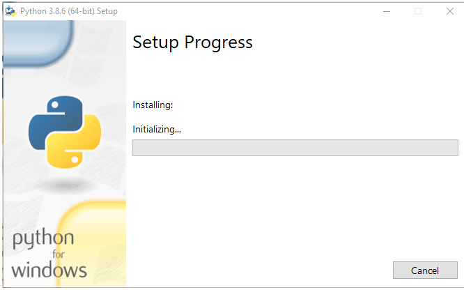
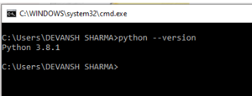

# SE-Assignment-6
 Assignment: Introduction to Python
Instructions:
Answer the following questions based on your understanding of Python programming. Provide detailed explanations and examples where appropriate.

 Questions:

1. Python Basics:
   - What is Python, and what are some of its key features that make it popular among developers? Provide examples of use cases where Python is particularly effective.

   Python is an interpreted, object-oriented, high-level programming language that can be used to create applications for different uses.
It's Simple
It's Free
It's Easy to Use
It's Highly Compatible
It is Object-Oriented
It has Lots of Libraries
It has Built-in Data Structures
It's Widely Applicable
It Increases Speed and Productivity
It's Easy to Learn

Web Development: Python frameworks like Django and Flask enable efficient web application development.

Data Analysis and Visualization: Python, with libraries like Pandas, Matplotlib, and Seaborn, is powerful for data manipulation and visualization.

Machine Learning and AI: Python's libraries like TensorFlow, PyTorch, and Scikit-learn are pivotal for machine learning and artificial intelligence projects.

Scientific Computing: Python's NumPy, SciPy, and Pandas are essential for scientific computing, data analysis, and simulations.

Game Development: Python, with libraries such as Pygame, supports game development, particularly for prototyping and indie games.

2. Installing Python:
   - Describe the steps to install Python on your operating system (Windows, macOS, or Linux). Include how to verify the installation and set up a virtual environment.

Visit the link https://www.python.org/downloads/ to download the latest release ofPython.

Step - 1: Select the Python's version to download.

Step - 2: Click on the Install Now double-click the executable file which is downloaded;the following window will open.
Select Customize installation and proceed.
Click on the Add Path check box, it will set the Python path automatically.

Step - 3 Installation in Process

Now, try to run python on the command prompt. Type the command python -version in case of python3.

Install virtualenv through the command pip install virtualenv. If you are not an administrator do not update if prompted
 
Check that virtualenv is installed through the command pip --version
Activate the Virtual Environment:.\env\Scripts\activate

3. Python Syntax and Semantics:
   - Write a simple Python program that prints "Hello, World!" to the console. Explain the basic syntax elements used in the program.

# Python program to print "Hello, World!"
print("Hello, World!")

Explanation:
The print() function in Python is used to output text (or other data types) to the console.
"Hello, World!" is enclosed in double quotes " " to denote it as a string literal, which will be printed exactly as written.

4. Data Types and Variables:
   - List and describe the basic data types in Python. Write a short script that demonstrates how to create and use variables of different data types.

Integer (int):
Represents whole numbers, positive or negative, without any decimal point.
Examples: -5, 0, 12345.

Float (float):
Represents real numbers with a decimal point.
Examples: 3.14, 2.71828, -0.001.

Boolean (bool):
Represents truth values True or False.
Used in logical operations, conditions, and control statements.
Examples: True, False.

String (str):
Represents sequences of characters enclosed within quotes (' or ").
Examples: 'Hello', "Python", '123'.

NoneType (None):
Represents a null or absence of value.
Used to denote a variable that does not refer to any object.
Example: None.

# Integer variable
age = 25

# Float variable
height = 1.75

# Boolean variable
is_student = True

# String variable
name = "John Doe"

# List variable
grades = [85, 90, 78, 92]

# Printing out variables
print(f"Name: {name}")
print(f"Age: {age}")
print(f"Height: {height} meters")
print(f"Is student? {is_student}")
print(f"Grades: {grades}")

# Accessing elements in the list
print(f"First grade: {grades[0]}")
print(f"Number of grades: {len(grades)}")

5. Control Structures:
   - Explain the use of conditional statements and loops in Python. Provide examples of an `if-else` statement and a `for` loop.

Loops and conditional statements are powerful constructs that allow programmers to automate repetitive tasks and control the flow of their programs based on certain conditions

if-else Statements
An if-else statement is used to execute one block of code if a certain condition is true, and another block of code if the condition is false. The basic syntax of an if-else statement is as follows:

if condition:
    # execute code if condition is true
else:
    # execute code if condition is false

    x = -5
if x > 0:
    print("x is positive")
else:
    print("x is negative")
Output:
x is negative

for Loops
A for loop is used to iterate over a sequence of elements, such as a list, tuple or string. The basic syntax of a for loop is as follows:

for element in sequence:
    # execute code

  fruits = ['apple', 'banana', 'cherry']
for fruit in fruits:
    print(fruit)

    Output:
apple
banana
cherr

6. Functions in Python:
   - What are functions in Python, and why are they useful? Write a Python function that takes two arguments and returns their sum. Include an example of how to call this function.

Python Functions is a block of statements that return the specific task.Functions provide better modularity for your application and a high degree of code reusing.
def sum_numbers(a, b):
    """Returns the sum of two numbers."""
    return a + b

# python function:
num1 = 5
num2 = 3
result = sum_numbers(num1, num2)
print(f"The sum of {num1} and {num2} is: {result}")

def sum_numbers(a, b):
    """Returns the sum of two numbers."""
    return a + b

# Example how to call the function:
num1 = 5
num2 = 3
result = sum_numbers(num1, num2)
print(f"The sum of {num1} and {num2} is: {result}")

Output:The sum of 5 and 3 is: 8

7. Lists and Dictionaries:
   - Describe the differences between lists and dictionaries in Python. Write a script that creates a list of numbers and a dictionary with some key-value pairs, then demonstrates basic operations on both.

A list is an ordered collection of items, whereas a dictionary is an unordered data collection in a key: value pair.
Elements from the list can be accessed using the index, while the elements of the dictionary can be accessed using keys.
The list allows duplicate items, while the dictionary does not allow any duplicate keys.
A list can store any data type. In contrast, keys in the dictionary can be of any immutable data type, and values can be of any data type.
Lists perform faster for ordered operations like sorting, while dictionaries perform faster for lookup operations.

# Creating a list of numbers
numbers = [1, 2, 3, 4, 5]

# Creating a dictionary with key-value pairs
person = {
    'name': 'Alice',
    'age': 30,
    'city': 'New York',
    'job': 'Engineer'
}

# Printing the list and dictionary
print("List of numbers:", numbers)
print("Dictionary - Person:", person)

# Output:
List of numbers: [1, 2, 3, 4, 5]
Dictionary - Person: {'name': 'Alice', 'age': 30, 'city': 'New York', 'job': 'Engineer'}

Demonstrating basic operations on both:

# Creating a list of numbers
numbers = [1, 2, 3, 4, 5]

# Creating a dictionary with key-value pairs
person = {
    'name': 'Alice',
    'age': 30,
    'city': 'New York',
    'job': 'Engineer'
}

# Basic operations on list
print("First number:", numbers[0])  # Accessing the first element
print("Length of numbers:", len(numbers))  # Length of the list

numbers.append(6)  # Append an element
print("Updated numbers list:", numbers)

subset = numbers[1:4]  # Slicing
print("Subset of numbers:", subset)

print()

# Basic operations on dictionary
print("Name of the person:", person['name'])  # Accessing value by key
print("Age of the person:", person.get('age'))  # Another way to access value

person['email'] = 'alice@example.com'  # Adding a new entry
person['age'] = 31  # Updating age
print("Updated person dictionary:", person)

del person['job']  # Deleting an entry
print("Updated person dictionary after deleting 'job':", person)

removed_age = person.pop('age')  # Removing and returning a value
print("Removed age from person dictionary:", removed_age)

8. Exception Handling:
   - What is exception handling in Python? Provide an example of how to use `try`, `except`, and `finally` blocks to handle errors in a Python script.

Exception handling in Python is a mechanism to handle runtime errors gracefully, preventing abrupt termination of a program.

Try Statement:

The try block is used to wrap the code that might throw an exception.
If an exception occurs within the try block, Python looks for a matching except block to handle the exception.

Except Clause:

The except block is used to catch and handle specific exceptions that occur within the try block.
You can specify the type of exception to catch (e.g., ZeroDivisionError, FileNotFoundError) or use a generic except to catch all exceptions.
Multiple except clauses can be used to handle different types of exceptions separately.

Finally Clause:

The finally block is optional and follows the try and except blocks.
It is executed whether an exception is raised or not.
Commonly used for cleanup actions like closing files or releasing resources.

# Example of Exception Handling:
try:
    # Code that may raise an exception
    num1 = int(input("Enter a number: "))
    num2 = int(input("Enter another number: "))
    result = num1 / num2
    print("Result:", result)

except ZeroDivisionError:
    print("Error: Division by zero!")

except ValueError:
    print("Error: Invalid input. Please enter a valid number.")

except Exception as e:
    print("Error:", e)

finally:
    print("Finally block executed.")

9. Modules and Packages:
   - Explain the concepts of modules and packages in Python. How can you import and use a module in your script? Provide an example using the `math` module.

In Python, both modules and packages organize and structure the code but serve different purposes. In simple terms, a module is a single file containing Python code, whereas a package is a collection of modules that are organized in a directory hierarchy

You can import an entire module using the import keyword followed by the module name.
If you only need specific functions or variables from a module, you can import them directly using the from ... import ... syntax.
You can also import a module or function with a different name using the as keyword.
Once a module is imported, you can use its functions, variables, or classes as needed in your script:

import math

# Calculate the square root of a number
number = 25
square_root = math.sqrt(number)
print(f"The square root of {number} is: {square_root}")

# Calculate the factorial of a number
factorial_num = 5
factorial_value = math.factorial(factorial_num)
print(f"The factorial of {factorial_num} is: {factorial_value}")

# Calculate the value of pi
pi_value = math.pi
print(f"The value of pi is: {pi_value}")

# Calculate the sine of an angle (in radians)
angle_radians = math.radians(45)
sin_value = math.sin(angle_radians)
print(f"The sine of 45 degrees is: {sin_value}")

# Output:

The square root of 25 is: 5.0
The factorial of 5 is: 120
The value of pi is: 3.141592653589793
The sine of 45 degrees is: 0.7071067811865475

10. File I/O:
    - How do you read from and write to files in Python? Write a script that reads the content of a file and prints it to the console, and another script that writes a list of strings to a file.

Reading files: Involves methods ( read() , readline() , readlines() ) to retrieve data from a file. 
Writing files: Involves methods ( write() , writelines() ) to store data into a file.

1.Reads

# Specify the file path
file_path = 'sample.txt'  # Replace with your file path

try:
    # Open the file in read mode
    with open(file_path, 'r') as file:
        # Read the entire content of the file
        file_content = file.read()
        
        # Print the content to the console
        print("File Content:")
        print(file_content)

except FileNotFoundError:
    print(f"Error: The file '{file_path}' was not found.")

except IOError as e:
    print(f"Error: Unable to read the file '{file_path}'.")
    print(f"Reason: {str(e)}")

2.Writes

    # List of strings to write to the file
lines = [
    "This is line 1.",
    "This is line 2.",
    "This is line 3."
]

# Specify the file path
file_path = 'output.txt'  # Replace with your desired file path

try:
    # Open the file in write mode
    with open(file_path, 'w') as file:
        # Write each line from the list to the file
        for line in lines:
            file.write(line + "\n")

    print(f"Successfully wrote {len(lines)} lines to '{file_path}'.")

except IOError as e:
    print(f"Error: Unable to write to the file '{file_path}'.")
    print(f"Reason: {str(e)}")

# Submission Guidelines:
- Your answers should be well-structured, concise, and to the point.
- Provide code snippets or complete scripts where applicable.
- Cite any references or sources you use in your answers.
- Submit your completed assignment by [due date].

